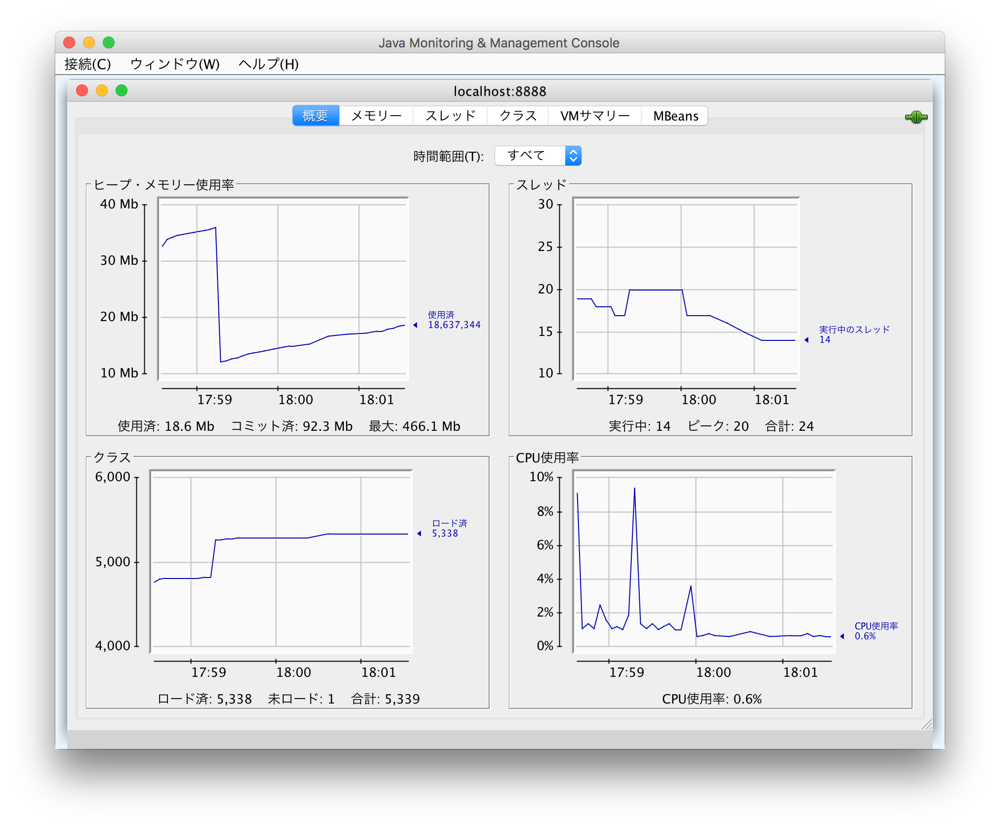

Hello World
===========

* [akka-http](https://doc.akka.io/docs/akka-http/current/introduction.html)

```
$ export JAVA_OPTS="\
-Djava.rmi.server.hostname=127.0.0.1 \
-Dcom.sun.management.jmxremote=true \
-Dcom.sun.management.jmxremote.port=9010 \
-Dcom.sun.management.jmxremote.rmi.port=9010 \
-Dcom.sun.management.jmxremote.ssl=false \
-Dcom.sun.management.jmxremote.authenticate=false \
-Dcom.sun.management.jmxremote.local.only=false"
$ docker run -d -e JAVA_OPTS -p 8080:8080 -p 9010:9010 --rm \
 helloworld:0.0.1-SNAPSHOT
```

# JConsole

localhost:9010 に接続します

